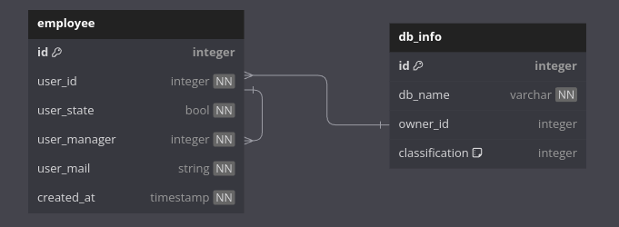

# Meli-Challenge

Desafío Meli

## Contexto

El equipo de Seguridad Informática de Mercado Libre, se encarga de hacer las reválidas anuales del proceso
de clasificación de la información. Sabemos por el feedback del año pasado, que generar reuniones
presenciales para validar esto, es un poco molesto para el usuario, más aún cuando las bases no son muy
críticas. Por eso y dado que estamos cerca de la fecha de reválida de bases de datos, este año queremos
hacerlo de manera automática. Pensamos pedirle a los managers de las bases más críticas que nos den el
OK por mail.

## Objetivo

Generar un programa que, a partir de los archivos dados, guarde su contenido en una base de datos y por
cada registro guardado, en donde la clasificación sea alta (high), envíe un email al manager del owner
pidiendo su OK respecto de la clasificación.

# Arquitectura propuesta

## Esquema de DB

El siguiente diagrama representa el esquema de la base de datos

